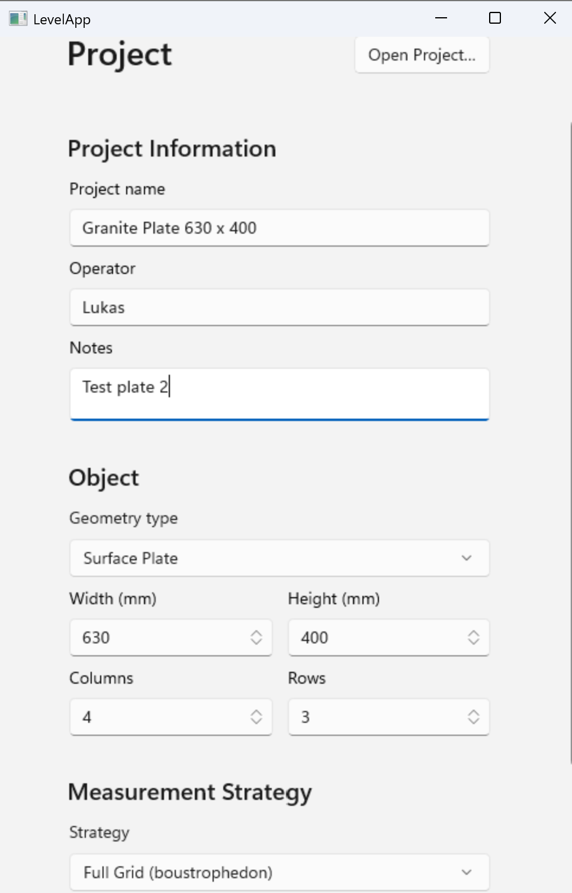
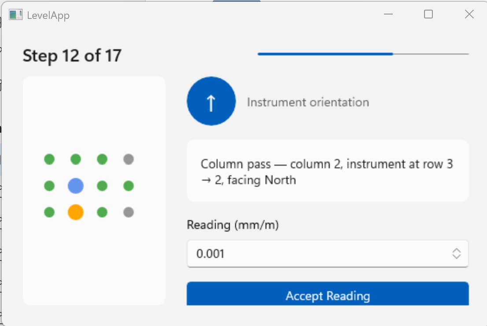
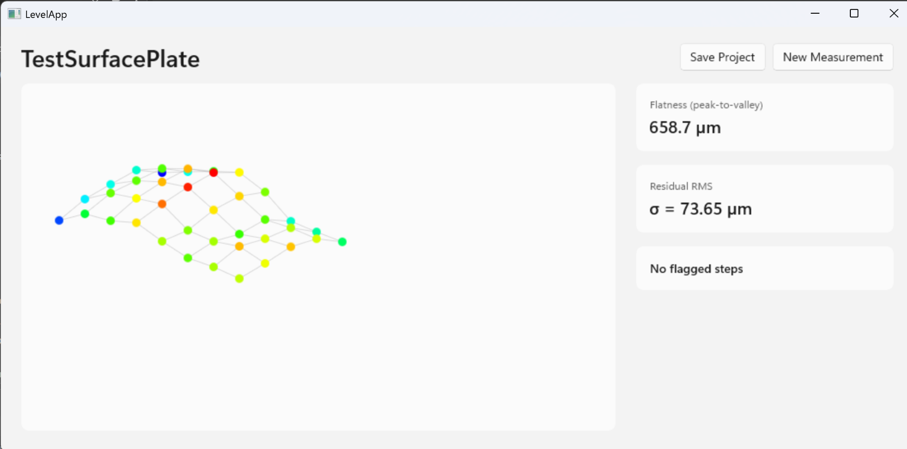

# LevelApp

A Windows desktop application for evaluating precision electronic level measurements used in machine tool geometry inspection and granite surface plate qualification.

The software guides the operator through a defined measurement procedure, acquires readings from a precision electronic level instrument, computes a best-fit surface map using least-squares adjustment, detects suspect readings, and displays results graphically.

---

## Features

- **Guided measurement workflow** — step-by-step instructions with a live grid map showing position, orientation arrow, and progress indicator
- **Full Grid strategy** — boustrophedon row and column traversal ensures every interior grid point is measured twice (once horizontally, once vertically) for redundancy
- **Least-squares surface fitting** — closure errors are distributed optimally across the grid rather than allowed to accumulate through simple sequential integration
- **Outlier detection** — suspect readings are flagged automatically when their residual exceeds a configurable sigma threshold (default: 2.5σ)
- **Correction workflow** — flagged steps can be re-measured in a guided mini-session; original readings are always preserved and the full correction history is stored
- **3D surface plot** — colour-mapped dot-and-wire visualisation of the fitted height map
- **Flatness result** — peak-to-valley flatness value and residual RMS displayed alongside the plot
- **Project persistence** — projects are saved as `.levelproj` files (JSON), human-readable and version-control friendly
- **Extensible architecture** — geometry modules, measurement strategies, instrument providers and display modules are all plugin-style interfaces; new object types and instruments can be added without touching existing code

---

## Screenshots

| Project Setup | Guided Measurement | Results |
|---|---|---|
|  |  |  |

---

## Technology Stack

| Concern | Choice |
|---|---|
| Language | C# (.NET 8/9) |
| UI Framework | WinUI 3 / Windows App SDK |
| UI Pattern | MVVM |
| Persistence | JSON via System.Text.Json |
| Bluetooth (planned) | Windows.Devices.Bluetooth (WinRT) |
| USB HID (planned) | Windows.Devices.HumanInterfaceDevice (WinRT) |

---

## Requirements

- Windows 10 version 1809 or later (Windows 11 recommended)
- [Windows App SDK runtime](https://learn.microsoft.com/en-us/windows/apps/windows-app-sdk/downloads)
- .NET 8 or .NET 9 runtime

---

## Getting Started

### Clone and build

```bash
git clone https://github.com/soldernerd/LevelApp.git
cd LevelApp
```

Open `LevelApp.sln` in Visual Studio 2022 and build the solution (`Ctrl+Shift+B`). Run the `App` project.

### Create a project

1. Enter a project name, operator name and optional notes
2. Select **Surface Plate** as the geometry type
3. Enter the plate dimensions (mm) and grid size (columns × rows)
4. Select a measurement strategy (currently: Full Grid)
5. Click **Start Measurement**

### Take measurements

The app guides you step by step. For each step it shows:

- The grid map with the current position highlighted
- The required instrument orientation (North / South / East / West)
- A plain-text instruction
- A reading entry field (mm/m)

Enter the reading from your electronic level and click **Accept Reading**. Repeat for all steps.

### Review results

After all steps are complete the app runs the least-squares solver and displays:

- A 3D colour-mapped surface plot
- Peak-to-valley flatness value
- Residual RMS (σ)
- Any flagged steps that warrant re-measurement

---

## Project Structure

```
LevelApp/
├── Core/                        # No UI dependencies — fully unit-testable
│   ├── Models/                  # Project, Session, Step, Result data models
│   ├── Interfaces/              # IGeometryModule, IMeasurementStrategy,
│   │                            # IInstrumentProvider, IResultDisplay
│   └── Geometry/SurfacePlate/   # SurfacePlateModule, FullGridStrategy,
│                                # SurfacePlateCalculator
├── Instruments/
│   └── ManualEntry/             # ManualEntryProvider (keyboard input)
├── App/                         # WinUI 3 application
│   ├── Views/                   # ProjectSetupView, MeasurementView, ResultsView
│   ├── ViewModels/              # MVVM view models
│   └── DisplayModules/          # SurfacePlot3DDisplay
└── docs/
    └── architecture.md          # Full architecture and design reference
```

---

## Roadmap

- [ ] Union Jack measurement strategy
- [ ] Heat map display module
- [ ] Numerical table display module
- [ ] Residuals chart display module
- [ ] Bluetooth LE instrument provider
- [ ] USB HID instrument provider
- [ ] Additional geometry modules (straightness, squareness, lathe bed, …)
- [ ] PDF report export
- [ ] German / English localisation

---

## Architecture

The full architecture and design rationale is documented in [`docs/architecture.md`](docs/architecture.md). It covers the data model hierarchy, the least-squares algorithm, the guided measurement state machine, the JSON file format with schema versioning, and the plugin interface contracts.

---

## Contributing

Contributions are welcome. Please open an issue to discuss significant changes before submitting a pull request.

1. Fork the repository
2. Create a feature branch (`git checkout -b feature/my-feature`)
3. Commit your changes (`git commit -m 'Add my feature'`)
4. Push to the branch (`git push origin feature/my-feature`)
5. Open a pull request

---

## License

Copyright (C) 2026 Lukas Fässler

This program is free software: you can redistribute it and/or modify it under the terms of the GNU General Public License as published by the Free Software Foundation, either version 3 of the License, or (at your option) any later version.

This program is distributed in the hope that it will be useful, but WITHOUT ANY WARRANTY; without even the implied warranty of MERCHANTABILITY or FITNESS FOR A PARTICULAR PURPOSE. See the GNU General Public License for more details.

You should have received a copy of the GNU General Public License along with this program. If not, see <https://www.gnu.org/licenses/>.
